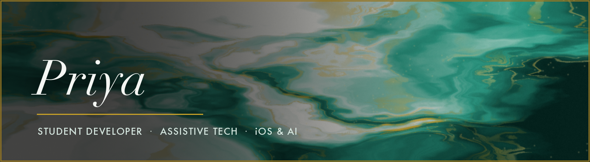
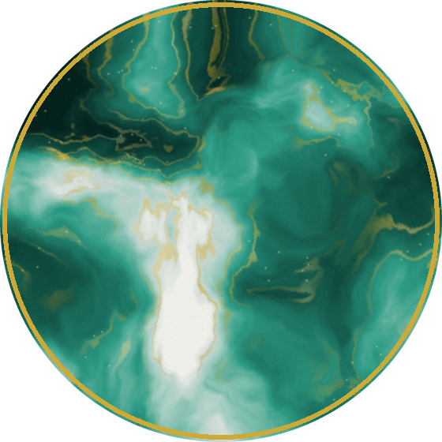

  

  

   

  
  
  

## 🔸 About

Interested in Embedded Systems and Computer Engineering, I'm trying to build projects that expand the scope of my experience and knowledge. I love building projects, whether it's a semester-long Capstone or a fun Hackathon prototype!

- 🔭 Currently building **SmartWalker**
- 🧠 Working through computer vision, sensor integration, and on-device inference 
- 🌱 Learning Swift and ARKit, after building basic Python and Java

 

## 🔸 Toolkit

**Languages**

**Machine Learning & Vision**

**Platforms & Tools**

## 🔸 Projects 🔸

### ​🇼​​🇴​​🇷​​🇰​/​🇸​​🇨​​🇭​​🇴​​🇴​​🇱👩🏾‍💻​

<table>
  <tr>
    <td width="50%" valign="top">

#### 🦯 [ai-smart-walker](https://github.com/priyaprabhudgp/ai-smart-walker)

An assistive navigation system for elderly and low-vision users moving
through indoor spaces. A Raspberry Pi with a camera and ultrasonic sensors
runs **YOLOv8** for obstacle detection and a custom door classifier, then
guides the user room-to-room with spoken turn-by-turn directions. Speech
recognition runs **fully offline** via Vosk — no network, no latency, no
privacy tradeoff.

`Python` `YOLOv8` `OpenCV` `Vosk` `Raspberry Pi`

  </td>
    <td width="50%" valign="top">

<!-- NOTE: airesx2/mobile-walker is currently PRIVATE (404 to logged-out
     visitors). Make it public, or drop the link and keep the text. -->
  </tr>
  <tr>
    <td colspan="2" valign="top">

#### 🍞 [Toasssst](https://github.com/priyaprabhudgp/Toasssst)

A team-built decision-making app that turns group indecision into a
structured set of choices.

`JavaScript`

  </td>
  </tr>
</table>

### ℍ𝕒𝕔𝕜𝕒𝕥𝕙𝕠𝕟𝕤 💡

<table>
  <tr>
    <td width="50%" valign="top">

#### ♿ [Accesify](https://github.com/1exii/accessibility-extension)

A browser extension that reshapes pages for readability, so the web works
for people the default experience leaves behind.

`JavaScript` `Browser Extension`

  </td>
    <td width="50%" valign="top">

#### 🩺 [CuringWithCare](https://github.com/airesx2/curing-with-care-WEBAPP)

A web app built around cancer awareness and support for our school's Curing With Care Chapter.

`JavaScript`

  </td>
  </tr>
  <tr>
    <td width="50%" valign="top">

#### 🧠 [PocketTherapy](https://github.com/1exii/bisvhacks)

A mental-health companion for naming and working through emotions, built at
BISV Hacks.

`JavaScript`

  </td>
    <td width="50%" valign="top">

#### 🛡️ [Sentinel](https://github.com/1exii/sentinel)

Sentinel is an intelligent danger detection and reporting platform designed to enhance community safety through real-time information sharing. Users can report incidents, view reports on a map, and access safety alerts to stay informed about their surroundings.

`JavaScript`

  </td>
  </tr>
</table>

### ☕ Coursework & Foundations

`SpringFinal` · `InheritanceLab` · `FallFinalProject` — object-oriented Java,
inheritance hierarchies, and a monster-fighting game built as a final
project. Where the fundamentals got learned.

## 🔸 By the Numbers

  
  
  

    

  <!--
    NOTE: these two cards use a community mirror of github-readme-stats.
    The official instance (github-readme-stats.vercel.app) is currently
    returning DEPLOYMENT_PAUSED. For a permanent fix, deploy your own copy
    to Vercel (see SETUP.md) and swap the hostname below.
  -->
  
  

  <!--
    Deliberately omitted: the streak card and the activity graph. Both render
    honestly but unflatteringly right now (current streak 0, longest 3 days,
    and a flat line since the last push). Re-add them once there's a run of
    activity worth showing -- the themed URLs are kept in SETUP.md.

    Also omitted: github-profile-trophy, whose public instance is dead (402).
  -->

<!--
  The snake below is generated by .github/workflows/snake.yml and served from
  your own `output` branch, so it never depends on someone else's server.
  It appears after the workflow runs once (Actions tab -> Run workflow).
-->

  <picture>
    <source media="(prefers-color-scheme: dark)" srcset="https://raw.githubusercontent.com/priyaprabhudgp/priyaprabhudgp/output/snake-dark.svg" />
    <source media="(prefers-color-scheme: light)" srcset="https://raw.githubusercontent.com/priyaprabhudgp/priyaprabhudgp/output/snake-light.svg" />
    
  </picture>

## 🔸 Elsewhere

  <!-- TODO: replace the two links below with your real email + LinkedIn, then delete this comment -->
  
  
  

 

